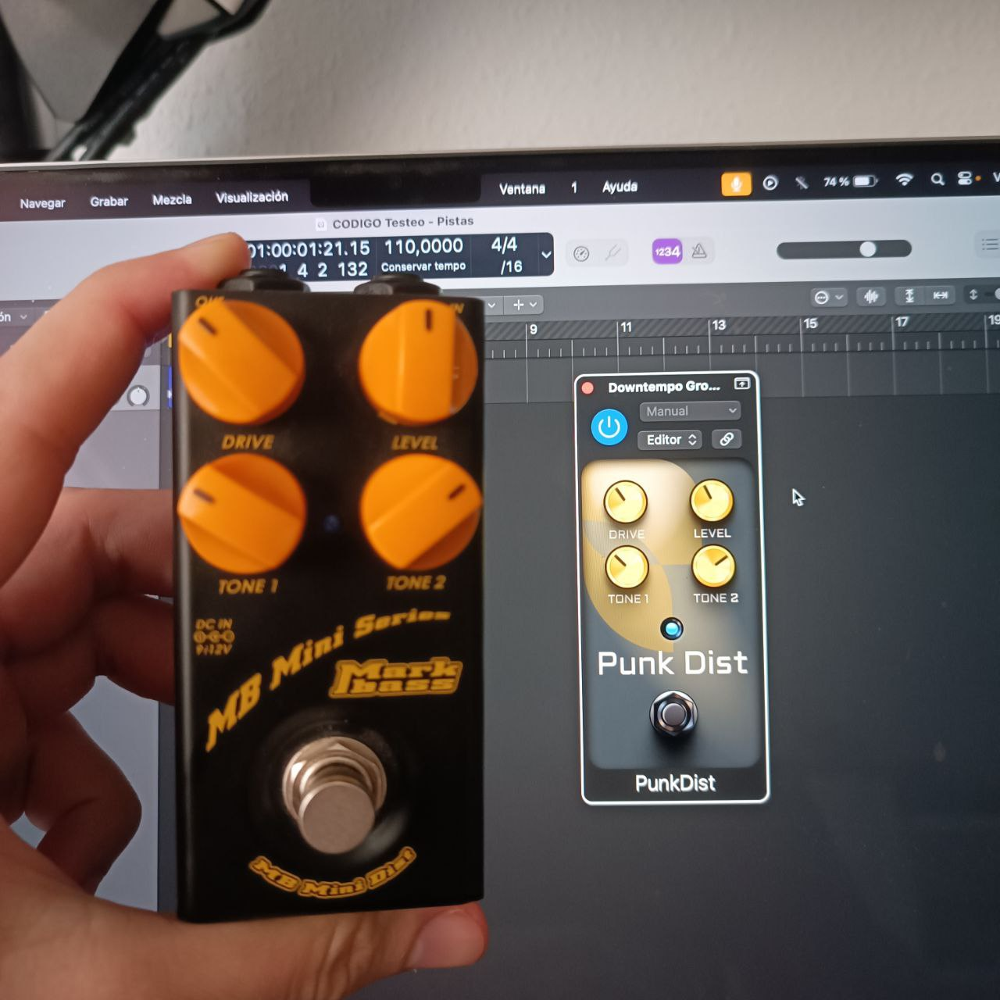

# PunkDist - A distortion pedal plugin

## Introduction
This is a simple vst3/au distortion plugin made with [JUCE](https://juce.com/) that I built to introduce myself in the JUCE framework. The goal was to replicate the behaviour of the [MiniDist by Markbass](https://www.markbass.it/product/mb-mini-dist/). The project was mostly used to further my understanding and knowledge of digital signal processing and digital audio effects.

## Features
- Drive gain: Uses inference to replicate the real pedal behaviour from a ML model.
- Output Gain (from -30 up to 30 dB).
- Tone 1: Selects the frequency (from 200 up to 2500 Hz) at which a small boost is applied. The boost amount also increases with the frequency, in fact, no boost is applied when the knob is at its minimum. 
- Tone 2: Dips the signal (from 0 down to -20 dB) at 800 Hz. It also applies a little bump at 80 Hz.

## Interesting links
* [Neural Networks for Real-Time Audio](https://medium.com/nerd-for-tech/neural-networks-for-real-time-audio-introduction-ed5d575dc341)
* [TS-9 cloned with Machine Learning](https://github.com/GuitarML/TS-M1N3/tree/main)
* [RTNeural](https://github.com/jatinchowdhury18/RTNeural)