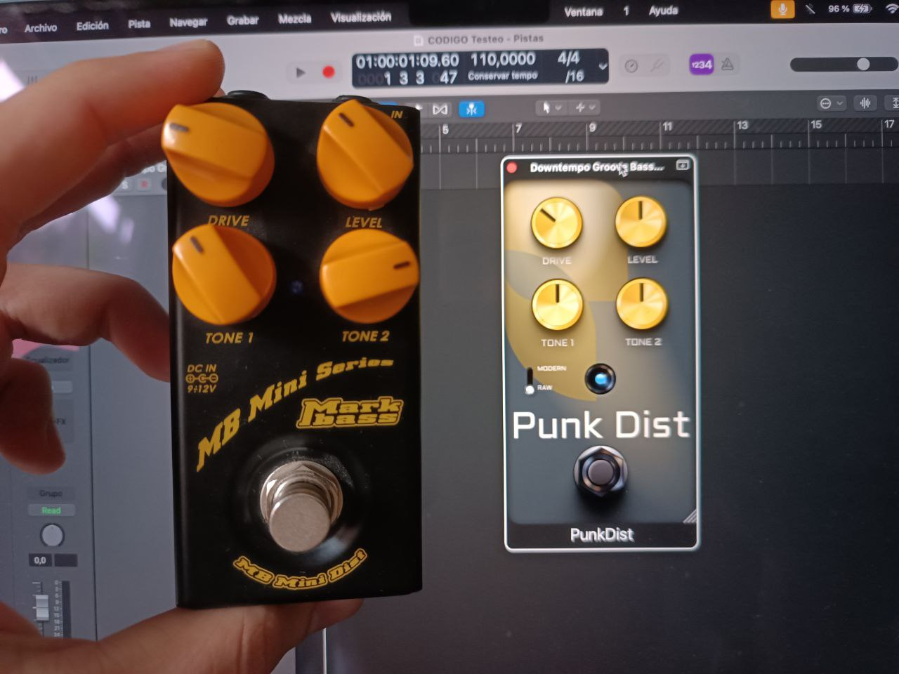

# PunkDist - A distortion pedal plugin

## Introduction
This is a simple vst3/au distortion plugin made with [JUCE](https://juce.com/) that I built to introduce myself in the JUCE framework. The functionality is inspired by the [MiniDist by Markbass](https://www.markbass.it/product/mb-mini-dist/), although it doesn't sound the same (yet). The project was mostly used to further my understanding and knowledge of digital signal processing and digital audio effects.
I intend to do a demostration soon enough, when the [future improvements](#future-improvements) list is shorter.

## Features
- Drive gain (from 0 up to 45 dB).
- Output Gain (from -30 up to 30 dB).
- Tone 1: Selects the frequency (from 200 up to 2500 Hz) at which a small boost is applied.
- Tone 2: Dips the signal (from 0 up to -20 dB) at 800 Hz.
- Mode switch (*not functioning*): This switch offers the following three voicings.
    - Raw: Distorts the whole signal, as most distortion pedals do.
    - Modern: Splits the spectrum in low (under 250Hz) and high (over 250Hz) bands and only distorts the high band.
 
 ## TODO
 - Migrate project to CMake.
 - I have to do a lot of testing and measures to replicate the distortion of the MiniDist, this implies that I should redo the whole drive processor.
 - The mode switch doesn't do anything by now...